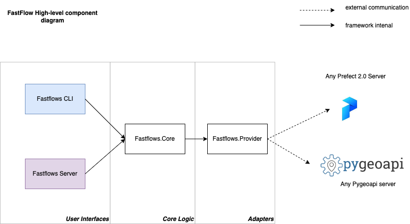

# Intro

FastFlows is a **command line tool** & Python **REST API Server** based on FastAPI that provides as set of tools to deploy, run & work with Flows on different workflows managers / orchestrators / process runners.

Right now supported 2 flows Providers / Engines : Prefect 2.0 (https://www.prefect.io/opensource/v2/) and (soon in next release) Pygeoapi Processes (https://docs.pygeoapi.io/en/latest/data-publishing/ogcapi-processes.html)

## Installation

More details: [Installation](installation.md)

```command

    pip install fastflows

```

## Quick start

To run FastFlows server

```

    fastflows server

```

By default FastFlows works with Prefect as provider and user localhost:4200 as default URI to find Prefect Server

To define

## Base Architecture

FastFlows contain 3 main blocks - User Interfaces to work with FastFlows (REST API & Cli), Core Logic (same methods are used with all User Interfaces) & Providers - connection adapters to communicate with Prefect or Pygeoapi (all depend on that you prefer to use)

Architecture diagramm:



## What's next

    mkdocs.yml    # The configuration file.
    docs/
        index.md  # The documentation homepage.
        ...       # Other markdown pages, images and other files.
